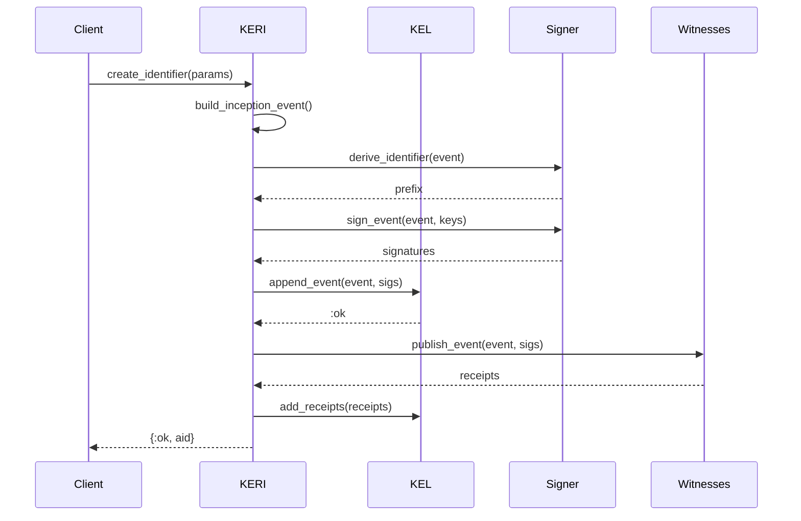

# KERI Protocol Architecture - Elixir Implementation

**Date:** 2025-11-07  
**Status:** Design Document  
**Target:** Full KERI protocol in Elixir layer

---

## 1. Overview

This document describes the architecture for implementing the full KERI (Key Event Receipt Infrastructure) protocol in Elixir, leveraging the existing Rust NIF for cryptographic primitives.

### 1.1 Architecture Principles

- **Rust Layer:** Cryptographic operations (signing, verification, CESR encoding)
- **Elixir Layer:** Protocol logic, state management, coordination
- **OTP Design:** Leverage GenServers, Supervisors, and ETS for fault tolerance
- **Event-Driven:** All state changes through immutable events

---

## 2. Module Structure

```
lib/signify/
├── keri/                           # KERI Protocol Implementation
│   ├── keri.ex                    # Main KERI module & public API
│   │
│   ├── events/                    # Event Types
│   │   ├── event.ex              # Base event behavior
│   │   ├── inception.ex          # Inception event (icp)
│   │   ├── rotation.ex           # Rotation event (rot)
│   │   ├── interaction.ex        # Interaction event (ixn)
│   │   ├── delegated_inception.ex # Delegated inception (dip)
│   │   └── delegated_rotation.ex  # Delegated rotation (drt)
│   │
│   ├── kel/                       # Key Event Log
│   │   ├── log.ex                # KEL GenServer
│   │   ├── storage.ex            # ETS/Mnesia storage adapter
│   │   ├── validator.ex          # Event validation
│   │   └── escrow.ex             # Out-of-order event escrow
│   │
│   ├── state/                     # Key State Management
│   │   ├── key_state.ex          # Key state struct & logic
│   │   ├── key_state_cache.ex    # ETS-backed key state cache
│   │   └── state_machine.ex      # State transition logic
│   │
│   ├── witnesses/                 # Witness System
│   │   ├── witness.ex            # Witness behavior
│   │   ├── witness_pool.ex       # Witness management GenServer
│   │   ├── receipt.ex            # Receipt validation
│   │   └── watcher.ex            # Witness watcher (optional)
│   │
│   ├── multisig/                  # Multi-Signature Support
│   │   ├── coordinator.ex        # Multi-sig coordination GenServer
│   │   ├── threshold.ex          # Threshold logic
│   │   └── partial_sigs.ex       # Partial signature collection
│   │
│   ├── delegation/                # Delegation
│   │   ├── delegator.ex          # Delegator management
│   │   ├── delegate.ex           # Delegate logic
│   │   └── anchor.ex             # Delegation anchoring
│   │
│   ├── identifier/                # AID (Autonomic Identifier)
│   │   ├── aid.ex                # AID struct & operations
│   │   ├── habery.ex             # Habitat creation/management
│   │   └── controller.ex         # Controller representation
│   │
│   ├── crypto/                    # Crypto wrappers (call Rust NIF)
│   │   ├── signer.ex             # Enhanced signer
│   │   ├── verfer.ex             # Enhanced verfer
│   │   └── crypto_suite.ex       # Crypto suite management
│   │
│   └── protocols/                 # Protocol Extensions
│       ├── did_keri.ex           # DID:KERI resolution
│       ├── oobi.ex               # Out-Of-Band Introduction
│       └── query.ex              # KERI query protocol
│
├── credentials/                   # Verifiable Credentials (existing, enhanced)
│   ├── credential.ex
│   ├── presentation.ex
│   └── acdc.ex                   # Authentic Chained Data Containers
│
└── application.ex                # Supervision tree
```

---

## 3. Supervision Tree

```
Signify.Application
│
├─ Signify.KERI.Supervisor
│  ├─ Signify.KERI.KEL.Log (GenServer)
│  ├─ Signify.KERI.State.KeyStateCache (GenServer)
│  ├─ Signify.KERI.Witnesses.WitnessPool (GenServer)
│  ├─ Signify.KERI.Multisig.Coordinator (GenServer)
│  └─ Signify.KERI.KEL.Escrow (GenServer)
│
└─ [Other application components]
```

---

## 4. Core Data Structures

### 4.1 Key Event Log Entry

```elixir
defmodule Signify.KERI.KEL.Entry do
  @type t :: %__MODULE__{
    sequence: non_neg_integer(),
    event: map(),                 # Serialized KERI event
    signatures: [binary()],       # Indexed signatures
    receipts: [map()],            # Witness receipts
    timestamp: DateTime.t(),
    previous_event_digest: binary()
  }
  
  defstruct [:sequence, :event, :signatures, :receipts, :timestamp, :previous_event_digest]
end
```

### 4.2 Key State

```elixir
defmodule Signify.KERI.State.KeyState do
  @type t :: %__MODULE__{
    prefix: String.t(),           # Identifier prefix (AID)
    sequence: non_neg_integer(),  # Current sequence number
    digest: binary(),             # Current event digest
    keys: [String.t()],          # Current signing keys (qb64)
    next_keys_digest: binary(),   # Digest of next keys
    threshold: pos_integer(),     # Signing threshold
    witnesses: [String.t()],      # Witness identifiers
    witness_threshold: pos_integer(), # Witness receipt threshold
    delegator: String.t() | nil,  # Delegator prefix (if delegated)
    last_event_type: atom(),      # :icp, :rot, :ixn, :dip, :drt
    establishment_only: boolean() # Establishment events only?
  }
  
  defstruct [
    :prefix, :sequence, :digest, :keys, :next_keys_digest,
    :threshold, :witnesses, :witness_threshold, :delegator,
    :last_event_type, :establishment_only
  ]
end
```

### 4.3 Event Schemas

```elixir
# Inception Event
%{
  "v" => "KERI10JSON000160_",  # Version string
  "t" => "icp",                 # Event type
  "d" => "",                    # SAID (self-addressing)
  "i" => "",                    # Identifier prefix (derived)
  "s" => "0",                   # Sequence number (hex)
  "kt" => "1",                  # Keys signing threshold
  "k" => ["D..."],             # List of signing keys (qb64)
  "nt" => "1",                  # Next threshold
  "n" => ["E..."],             # Next keys commitment (digest)
  "bt" => "2",                  # Witness threshold
  "b" => ["B...", "B..."],     # Witness identifiers
  "c" => [],                    # Configuration traits
  "a" => []                     # Anchors (seals)
}

# Rotation Event
%{
  "v" => "KERI10JSON000160_",
  "t" => "rot",
  "d" => "",                    # SAID
  "i" => "E...",               # Identifier
  "s" => "1",                   # Sequence number
  "p" => "E...",               # Prior event digest
  "kt" => "1",                  # Keys signing threshold
  "k" => ["D..."],             # Current signing keys
  "nt" => "1",                  # Next threshold
  "n" => ["E..."],             # Next keys commitment
  "bt" => "2",                  # Witness threshold (can change)
  "br" => [],                   # Witness rotation cuts
  "ba" => [],                   # Witness rotation adds
  "a" => []                     # Anchors
}

# Interaction Event
%{
  "v" => "KERI10JSON000120_",
  "t" => "ixn",
  "d" => "",
  "i" => "E...",
  "s" => "2",
  "p" => "E...",
  "a" => []                     # Anchors (payload)
}

# Delegated Inception
%{
  "v" => "KERI10JSON000160_",
  "t" => "dip",
  "d" => "",
  "i" => "",
  "s" => "0",
  "kt" => "1",
  "k" => ["D..."],
  "nt" => "1",
  "n" => ["E..."],
  "bt" => "0",                  # No witnesses for delegated
  "b" => [],
  "c" => [],
  "a" => [],
  "di" => "E..."               # Delegator identifier
}

# Delegated Rotation
%{
  "v" => "KERI10JSON000160_",
  "t" => "drt",
  "d" => "",
  "i" => "E...",
  "s" => "1",
  "p" => "E...",
  "kt" => "1",
  "k" => ["D..."],
  "nt" => "1",
  "n" => ["E..."],
  "bt" => "0",
  "br" => [],
  "ba" => [],
  "a" => []
}
```

---

## 5. Key Operations & Flows

### 5.1 Create Identifier (Inception)

```elixir
# Public API
{:ok, aid} = Signify.KERI.create_identifier(%{
  keys: ["D..."],              # Current signing keys
  next_keys: ["D..."],         # Next keys commitment
  threshold: 1,
  witnesses: ["B...", "B..."],
  witness_threshold: 2,
  transferable: true
})
```

**Flow:**
1. Generate inception event
2. Derive identifier prefix from event
3. Sign event with current keys
4. Store event in KEL
5. Initialize key state
6. Send to witnesses (if any)
7. Collect witness receipts
8. Return AID

**Sequence Diagram:**


### 5.2 Rotate Keys

```elixir
{:ok, rotation_event} = Signify.KERI.rotate_keys(aid, %{
  current_keys: ["D..."],      # Keys being rotated out
  new_keys: ["D..."],          # Keys being rotated in
  next_keys: ["D..."],         # New next keys commitment
  witness_cuts: [],            # Witnesses to remove
  witness_adds: []             # Witnesses to add
})
```

**Flow:**
1. Validate current key state
2. Validate new keys match previous commitment
3. Build rotation event
4. Sign with current keys (being rotated out)
5. Append to KEL
6. Update key state
7. Publish to witnesses
8. Collect receipts

### 5.3 Create Interaction Event

```elixir
{:ok, ixn_event} = Signify.KERI.interact(aid, %{
  anchors: [%{
    "d" => "E..."  # Digest of anchored data (credential, etc.)
  }]
})
```

**Flow:**
1. Get current key state
2. Build interaction event
3. Sign with current keys
4. Append to KEL
5. Update sequence number
6. Publish to witnesses

### 5.4 Verify Event Chain

```elixir
{:ok, valid?} = Signify.KERI.verify_event_chain(prefix)
```

**Flow:**
1. Fetch all events from KEL
2. Validate inception event
3. For each subsequent event:
   - Verify signatures match key state
   - Verify previous event digest
   - Verify sequence number progression
   - Apply event to key state
4. Return validation result

---

## 6. Component Details

### 6.1 KEL GenServer

**State:**
```elixir
%{
  storage: :ets | :mnesia,
  table_name: atom(),
  escrow: pid()
}
```

**API:**
```elixir
def append_event(prefix, event, signatures)
def get_events(prefix, opts \\ [])
def get_event_at_sequence(prefix, sequence)
def get_current_sequence(prefix)
def add_receipts(prefix, sequence, receipts)
def verify_chain(prefix)
```

**Storage Schema (ETS):**
```elixir
# Table: :keri_events
{prefix, sequence, entry}

# Indices:
- Primary: {prefix, sequence}
- Timestamp index for queries
```

### 6.2 Key State Cache GenServer

**State:**
```elixir
%{
  cache: :ets.tid(),          # ETS table for key states
  ttl: integer(),             # Cache TTL (milliseconds)
  cleanup_interval: integer()
}
```

**API:**
```elixir
def get_key_state(prefix)
def update_key_state(prefix, key_state)
def invalidate(prefix)
def rebuild_from_kel(prefix)
```

**Optimization:**
- ETS table for fast lookups
- Periodic cache cleanup
- Rebuild from KEL on cache miss

### 6.3 Event Validator

**Pure functions for validation:**
```elixir
def validate_inception(event, signatures)
def validate_rotation(event, signatures, prior_key_state)
def validate_interaction(event, signatures, key_state)
def validate_delegated_inception(event, signatures, delegator_anchor)
def validate_delegated_rotation(event, signatures, prior_key_state, delegator_anchor)

def verify_signatures(event, signatures, keys, threshold)
def verify_next_keys_commitment(new_keys, prior_commitment)
def verify_event_digest(event, stated_digest)
def verify_prior_event_digest(event, prior_event)
```

### 6.4 Witness Pool GenServer

**State:**
```elixir
%{
  witnesses: %{
    "B..." => %{url: String.t(), status: :available | :offline}
  },
  pending_receipts: %{
    {prefix, sequence} => %{
      event: map(),
      signatures: [binary()],
      received: [String.t()],  # Witness identifiers that responded
      threshold: pos_integer()
    }
  }
}
```

**API:**
```elixir
def register_witness(identifier, url)
def publish_event(event, signatures, witness_list)
def collect_receipts(prefix, sequence, threshold)
def get_witness_status(identifier)
```

### 6.5 Multi-sig Coordinator GenServer

**State:**
```elixir
%{
  pending_signatures: %{
    event_digest => %{
      event: map(),
      required_signatures: pos_integer(),
      received_signatures: [%{index: integer(), signature: binary(), verfer: String.t()}],
      participants: [String.t()]  # Participant identifiers
    }
  }
}
```

**API:**
```elixir
def initiate_multisig(event, participants, threshold)
def add_signature(event_digest, signature, signer_index)
def check_threshold(event_digest)
def finalize_multisig(event_digest)
```

---

## 7. Implementation Priority

### Phase 1: Core KEL (Week 1-2)
Priority: **P0** - Foundation

1. ✅ Event schemas and structs
2. ✅ KEL GenServer with ETS storage
3. ✅ Event validation logic
4. ✅ Key State struct and logic
5. ✅ Inception event creation and validation
6. ✅ Basic identifier creation API
7. ✅ Unit tests for core components

**Deliverables:**
- Can create identifiers
- Can store events in KEL
- Can validate inception events
- Can retrieve key state

### Phase 2: Event Types (Week 3)
Priority: **P0** - Essential protocol

1. ✅ Rotation event implementation
2. ✅ Interaction event implementation
3. ✅ Event chain validation
4. ✅ Key rotation API
5. ✅ Interaction API
6. ✅ Integration tests

**Deliverables:**
- Complete event lifecycle
- Key rotation working
- Chain validation working

### Phase 3: Witnesses (Week 4)
Priority: **P1** - Important for production

1. ✅ Witness pool GenServer
2. ✅ Receipt validation
3. ✅ HTTP client for witness communication
4. ✅ Receipt collection logic
5. ✅ Witness threshold enforcement

**Deliverables:**
- Witness system functional
- Can collect receipts
- Threshold validation

### Phase 4: Delegation (Week 5)
Priority: **P1** - Key KERI feature

1. ✅ Delegated inception
2. ✅ Delegated rotation
3. ✅ Delegation anchoring
4. ✅ Delegator validation

**Deliverables:**
- Can create delegated identifiers
- Can validate delegation chains

### Phase 5: Multi-sig (Week 6)
Priority: **P2** - Advanced feature

1. ✅ Multi-sig coordinator
2. ✅ Threshold logic
3. ✅ Partial signature collection
4. ✅ Multi-sig finalization

**Deliverables:**
- Multi-sig identifiers working
- Threshold signatures working

### Phase 6: Advanced Features (Week 7-8)
Priority: **P2-P3**

1. ✅ Escrow for out-of-order events
2. ✅ DID:KERI resolution
3. ✅ OOBI (Out-Of-Band Introduction)
4. ✅ Query protocol
5. ✅ Performance optimizations

**Deliverables:**
- Complete KERI protocol
- Advanced features operational

### Phase 7: Production Readiness (Week 9-10)
Priority: **P0**

1. ✅ Comprehensive test suite
2. ✅ Performance benchmarks
3. ✅ Documentation
4. ✅ Migration guides
5. ✅ Security audit

---

## 8. API Examples

### 8.1 Basic Identifier Creation

```elixir
# Create a signer
{:ok, signer} = Signify.Signer.new_random(true)
{:ok, verfer} = Signify.Signer.verfer(signer)
{:ok, verfer_qb64} = Signify.Verfer.to_qb64(verfer)

# Create pre-rotated keys
{:ok, next_signer} = Signify.Signer.new_random(true)
{:ok, next_verfer} = Signify.Signer.verfer(next_signer)
{:ok, next_verfer_qb64} = Signify.Verfer.to_qb64(next_verfer)

# Create identifier
{:ok, aid} = Signify.KERI.create_identifier(%{
  keys: [verfer_qb64],
  next_keys: [next_verfer_qb64],
  signers: [signer],
  threshold: 1,
  witnesses: [],
  witness_threshold: 0,
  transferable: true
})

IO.puts("Created identifier: #{aid.prefix}")
```

### 8.2 Key Rotation

```elixir
# Rotate to next keys
{:ok, rotation} = Signify.KERI.rotate_keys(aid.prefix, %{
  signers: [next_signer],            # Previous "next" keys
  new_keys: [new_verfer_qb64],       # New current keys
  next_keys: [newer_verfer_qb64],    # New next keys
  threshold: 1
})

IO.puts("Rotated to sequence: #{rotation.sequence}")
```

### 8.3 Anchoring Data

```elixir
# Create a credential
credential = %{
  "@context" => ["https://www.w3.org/2018/credentials/v1"],
  "type" => ["VerifiableCredential"],
  "issuer" => aid.prefix,
  "credentialSubject" => %{"name" => "Alice"}
}

# Get credential digest
{:ok, cred_digest} = Signify.KERI.Crypto.digest(Jason.encode!(credential))

# Anchor credential in KEL
{:ok, ixn} = Signify.KERI.interact(aid.prefix, %{
  signers: [current_signer],
  anchors: [%{"d" => cred_digest}]
})

IO.puts("Anchored credential at sequence: #{ixn.sequence}")
```

### 8.4 Delegated Identifier

```elixir
# Delegator creates delegated identifier
{:ok, delegate_aid} = Signify.KERI.create_delegated_identifier(%{
  delegator: delegator_aid.prefix,
  delegator_signer: delegator_signer,
  keys: [delegate_verfer_qb64],
  next_keys: [delegate_next_verfer_qb64],
  signers: [delegate_signer],
  threshold: 1
})

IO.puts("Created delegated identifier: #{delegate_aid.prefix}")
```

### 8.5 Multi-sig Identifier

```elixir
# Create multi-sig with 2-of-3 threshold
{:ok, multisig_aid} = Signify.KERI.create_multisig_identifier(%{
  keys: [verfer1_qb64, verfer2_qb64, verfer3_qb64],
  next_keys: [next1_qb64, next2_qb64, next3_qb64],
  threshold: 2,  # 2 of 3 required
  witnesses: [],
  witness_threshold: 0
})

# Sign with participant 1
{:ok, partial_sig1} = Signify.KERI.Multisig.sign(
  multisig_aid.prefix, 
  event, 
  signer1, 
  0  # Index 0
)

# Sign with participant 2
{:ok, partial_sig2} = Signify.KERI.Multisig.sign(
  multisig_aid.prefix, 
  event, 
  signer2, 
  1  # Index 1
)

# Finalize (threshold met)
{:ok, finalized} = Signify.KERI.Multisig.finalize(multisig_aid.prefix, event)
```

---

## 9. Testing Strategy

### 9.1 Unit Tests
- Event creation and serialization
- Signature validation
- Key state transitions
- CESR encoding/decoding

### 9.2 Integration Tests
- Full identifier lifecycle
- Key rotation scenarios
- Witness receipt collection
- Delegation chains
- Multi-sig coordination

### 9.3 Property Tests
- Event chain integrity
- Key state consistency
- Signature threshold enforcement

### 9.4 Performance Tests
- KEL query performance
- Key state cache hit rate
- Concurrent event processing

---

## 10. Migration from Current Implementation

### 10.1 Backwards Compatibility

The new KERI implementation will be **additive**, not breaking:

```elixir
# Old API (still works)
{:ok, signer} = Signify.Signer.new_random(true)
{:ok, signature} = Signify.Signer.sign(signer, message)

# New API (enhanced)
{:ok, aid} = Signify.KERI.create_identifier(...)
```

### 10.2 Migration Path

1. **Phase 1:** New KERI modules alongside existing code
2. **Phase 2:** Enhanced credential module uses KERI
3. **Phase 3:** Deprecate simple signing API (optional)
4. **Phase 4:** Full KERI as default

---

## 11. Performance Considerations

### 11.1 Optimization Strategies

- **ETS for KEL storage** - In-memory, fast lookups
- **Key state caching** - Avoid re-computing from KEL
- **Lazy witness receipt collection** - Don't block on witnesses
- **Concurrent event validation** - Task.async for parallel validation
- **Event batching** - Process multiple events together

### 11.2 Scalability

- **Horizontal scaling** - Distribute KEL across nodes (future)
- **Event sharding** - Partition KEL by identifier prefix
- **Witness pools** - Load balance across witnesses
- **Caching layers** - Redis for distributed cache (future)

---

## 12. Security Considerations

### 12.1 Threat Model

- **Replay attacks** - Mitigated by sequence numbers
- **Fork attacks** - Mitigated by witness threshold
- **Compromised keys** - Mitigated by key rotation
- **Unauthorized delegation** - Mitigated by delegation validation

### 12.2 Security Measures

- Input validation on all events
- Signature verification before state updates
- Strict event ordering enforcement
- Witness threshold enforcement
- Delegation chain validation

---

## 13. Documentation Requirements

1. **Architecture guide** (this document)
2. **API reference** (ExDoc)
3. **Tutorial** (step-by-step guide)
4. **Migration guide** (from simple to KERI)
5. **Best practices** (security, performance)
6. **Troubleshooting** (common issues)

---

## 14. Success Criteria

### 14.1 Functional Requirements

- ✅ Can create KERI identifiers
- ✅ Can rotate keys
- ✅ Can create interaction events
- ✅ Can validate event chains
- ✅ Can collect witness receipts
- ✅ Can create delegated identifiers
- ✅ Can create multi-sig identifiers

### 14.2 Non-Functional Requirements

- ✅ < 10ms event creation latency
- ✅ < 5ms event validation latency
- ✅ > 1000 events/second throughput
- ✅ > 99.9% uptime
- ✅ Comprehensive test coverage (>90%)

---

**Next Steps:**

1. Review and approve architecture
2. Create initial module structure
3. Implement Phase 1 (Core KEL)
4. Write comprehensive tests
5. Iterate based on feedback

---

**Approval:**

- [ ] Architecture Approved
- [ ] Ready for Implementation

**Status:** DRAFT - Awaiting Review
